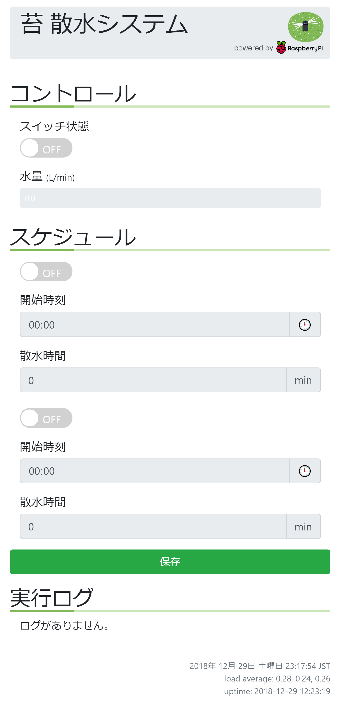

# rasp-water

Raspberry Pi Zero W を使って自動的に水やりをするシステムです．

## 機能

- スマホやパソコンから蛇口の開閉が行えます．
- 水流量がリアルタイムに確認できます．
- スケジュール機能を使って自動水やりが行えます．
- 水やりの記録が確認できます．

## 構成

Angular で作られた UI と，Flask で作られたアプリケーションサーバで構成
されます．raspi-gpio を使って GPIO を制御し，その先につながった電磁弁
で蛇口の開閉を行います．

スケジュール機能は cron ファイルを読み書きして実現しています．

ログ機能は SQLite を使っています．

ハード関係は[ブログ](https://rabbit-note.com/2018/12/31/raspberry-pi-watering-system-hard/)で紹介しています．

## カスタマイズ

電磁弁の制御は rasp_water.py の {set,get}_valve_state で行っていますの
で，ここを書き換えることで制御方法を変えることができます．

## スクリーンショット



## 準備

### ライブラリのインストール

```bash:bash
sudo apt install npm
sudo apt install python3-pip
sudo apt install python3-flask
sudo pip3 install python-crontab
```

Ubuntu 18.04 の場合，apt install python3-crontab でインストールしたライブラ
リだとバージョンが古いのでエラーが出ます．

### ADS1015 のドライバの有効化

/boot/config.txt に次の行を追加．

```bash:bash
dtoverlay=ads1015,cha_gain=1
```

## ビルド方法

```bash:bash
npm update
sudo npm install -g @angular/cli
ng build --base-href /rasp-water/ --prod
```

## 実行方法

```bash:bash
python3 flask/app.py
```
